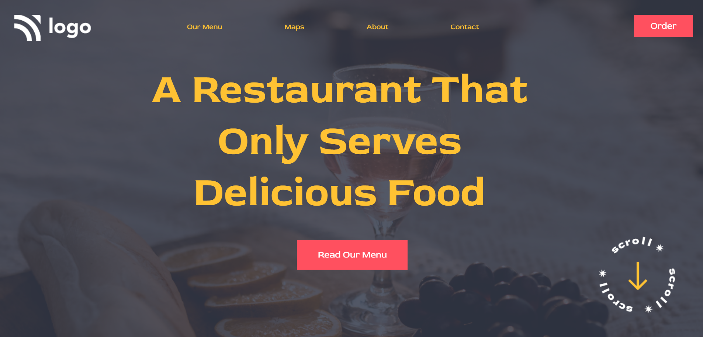

# Description
This is a sample page. The website focuses on implementing the basics of HTML and CSS to create this Restaurant Webpage.
## Time taken 
Approximately

1hours and 40 mins = 1 hours and 10 mins + 30mins(responsive)

## Things I learnt

- CSS pseudo classes
- CSS attribute selectors
## Deployed Link

[Restaurant Landing Page](https://logorestaurant.netlify.app/)

### Snapshot of the Webpage

